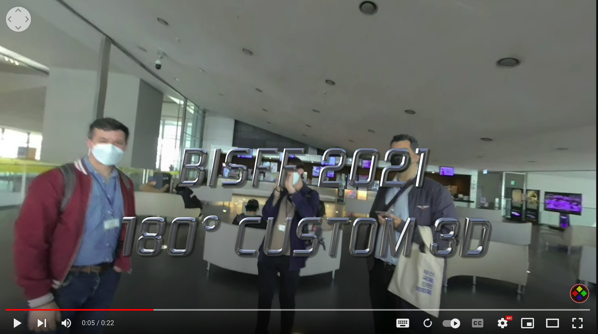

# vuze camera vr studio

The vuze camera was a VR360 degree and a VR180 degree camera designed for immersive panorama movie and pictures. The foldable design makes the camera unique and allows to record VR180 stereoscopic videos for youtube. And example can be found here:

[]([https://www.youtube.com/watch?v=StTqXEQ2l-Y](https://www.youtube.com/watch?v=A2DbbAP1yTQ) "Vuze VR180 Example")


This repository contains a html backup of the official vuze.camera vr software download page.

as the official vuze.camera page throws and SSL error consumers are not able to download the vr studio software anymore.
this page shows a backup obtained using curl and bypassing the ssl security check with the command.

```
curl --insecure https://vuze.camera/support/vr-software/vuze-vr-studio
```

the links to the software are still active as per: 2023.03.22

##vuze vr studio windows version

https://s3.amazonaws.com/downloads.vuze.camera/studio/w/VuzeVRStudioSetup.exe

##vuze vr studio mac version

https://s3.amazonaws.com/downloads.vuze.camera/studio/m/VuzeVRStudio.dmg

all rights remain with the original rights owners.

